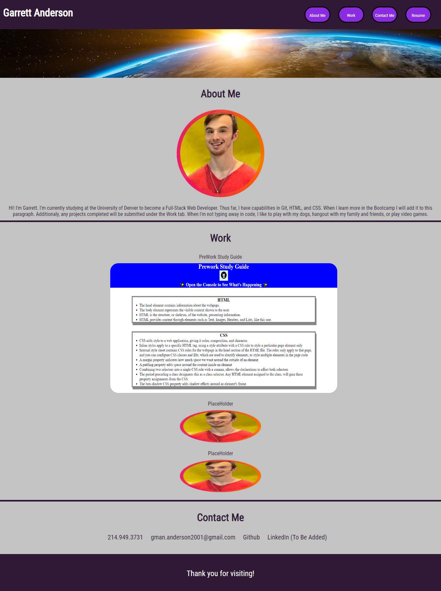

# MyPortfolio

Garrett Anderson's Portfolio

## Description

This is my personal portfolio! It showcases some information about myself, previous projects and work experience, and also way you can get into contact with me! This was built using HTML and CSS to show off my capabilities in said languages.

##

1. [Deployed Page](#deployed-page)
2. [Contents of Webpage](#contents-of-webpage)
3. [Credits](#credits)

## Deployed Page

[Deployed Github Page](https://garretta01.github.io/MyPortfolio/)

## Contents of Webpage

- Header with my full name and buttons to navigate
- About Section with a short paragraph about my experience and hobbies
- Profile Image of myself
- Work section with past projects
- Contact Section with my various forms of contact

##

- Page built by Garrett Anderson
